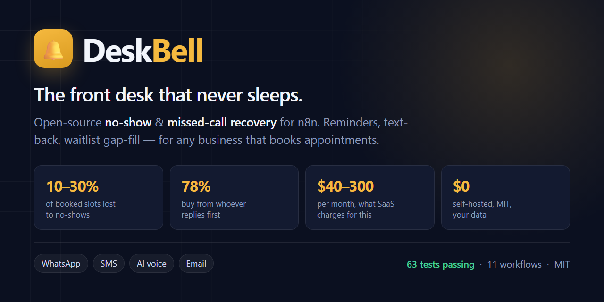

<div align="center">



# 🔔 DeskBell

**Open-source appointment reminder & missed-call recovery software.**
Reduce no-shows, text back every missed call, and fill cancelled slots — self-hosted on [n8n](https://n8n.io).

[](LICENSE)
[](https://n8n.io)
[](tests/core.test.mjs)
[](https://github.com/kapoordeepanshu/DeskBell/actions)

[Quickstart](#quickstart-10-minutes) · [How it works](#how-it-works) · [Compare](#how-deskbell-compares) · [FAQ](#faq) · [Docs](docs/setup.md)

</div>

---

## The problem: three leaks, all automatable

Every business that books appointments loses money in the same three places.

| Leak | What it costs you | Benchmark |
|---|---|---|
| **No-shows** | An empty chair earns nothing and can't be resold | **10–30%** of booked slots |
| **Missed calls** | The caller rings your competitor next | ~30% of SMB calls go unanswered; **78% of customers buy from whoever replies first** |
| **Never rebooked** | A one-time customer instead of a regular | Recall is almost always manual |

SMS reminders alone cut no-shows by around **38%**. Reminders plus waitlist gap-fill can take no-shows under **5%**.

Commercial tools do this for **$40–300/month**, per location, with your customer data on their servers. DeskBell does it on infrastructure you own, for the cost of your Twilio bill.

## What DeskBell does

- 📅 **Multi-stage appointment reminders** — T-7d → T-24h → T-3h, over WhatsApp, SMS or email
- ✅ **Two-way confirmations** — customers reply `YES` / `NO` / `CANCEL` and your calendar updates itself
- 📞 **Missed-call text-back** — an unanswered call gets an SMS within seconds, with your booking link
- 🎙️ **AI voice reminders** — [VAPI](https://vapi.ai) calls high-value bookings that never replied
- 🔁 **Waitlist gap-fill** — a cancellation is instantly offered to people waiting
- ⭐ **Review requests & recall** — after the visit, and again when they're due back
- 📊 **Daily ROI digest** — today's unconfirmed list, and revenue protected this week, in your currency
- 🏥 **Any vertical** — dental, salon, physio, veterinary, auto repair, home services, tutoring

## How it works

```
   Booking source               DeskBell engine                  Channels
 ┌────────────────┐        ┌──────────────────────┐        ┌──────────────────┐
 │ Google Calendar│        │  Reminder ladder     │        │ WhatsApp Cloud   │
 │ Cal.com        │───────▶│  T-7d → T-24h → T-3h │───────▶│ Twilio SMS       │
 │ Any booking    │        │                      │        │ VAPI voice       │
 │ system (hook)  │        │  Consent gate        │        │ Email (SMTP)     │
 └────────────────┘        │  Quiet hours         │        └──────────────────┘
                           │  Idempotency keys    │                 │
 ┌────────────────┐        │  State machine       │◀────────────────┘
 │ Missed call    │───────▶│  Fallback ladder     │   replies: CONFIRM / CANCEL
 │ (Twilio hook)  │        └──────────┬───────────┘             STOP / free text
 └────────────────┘                   │
                                      ▼
                      ┌────────────────────────────────┐
                      │ Waitlist gap-fill · Review     │
                      │ requests · Recall · ROI digest │
                      └────────────────────────────────┘
```

Eleven n8n workflows, driven by **one config file**. Details in [`docs/architecture.md`](docs/architecture.md).

## How DeskBell compares

I searched GitHub before building this. Here is the honest landscape.

| | Free n8n templates | SaaS (Podium, Weave, Apptoto…) | **DeskBell** |
|---|:---:|:---:|:---:|
| Price | Free | $40–300/mo per location | **Free, self-hosted** |
| Your data stays yours | ✅ | ❌ | ✅ |
| Can't double-text a customer | ❌ | ✅ | ✅ |
| STOP / consent / quiet hours | ❌ | ✅ | ✅ |
| Channel fallback (WhatsApp→SMS→voice) | ❌ | Partial | ✅ |
| Missed-call text-back | ❌ | ✅ | ✅ |
| Waitlist gap-fill | ❌ | Sometimes | ✅ |
| Works for any vertical | ❌ hardcoded | Per-industry pricing | ✅ config presets |
| Error handling & alerting | ❌ | ✅ | ✅ |
| Shows you the ROI | ❌ | ✅ | ✅ |
| Unit-tested logic | ❌ | n/a | ✅ 63 tests |

Every appointment-reminder repo I found on GitHub has **0–3 stars** and is a single-workflow demo hardcoded to one clinic. The template *collections* have 24k stars but ship no product thinking at all.

**DeskBell isn't competing with the templates. It's the self-hosted answer to the $300/month tools.**

## Quickstart (10 minutes)

```bash
git clone https://github.com/kapoordeepanshu/DeskBell.git
cd DeskBell
cp .env.example .env      # add your provider keys
docker compose up -d      # n8n + Postgres on http://localhost:5678
npm run import            # create and cross-link all 11 workflows
```

Then:

1. **Pick your vertical** — `cp config/presets/dental.json config/config.json`
   (also: `salon`, `physio`, `veterinary`, `auto-repair`, `home-services`, `tutoring`)
2. **Edit it** — business name, timezone, currency, `avgAppointmentValue`, booking URL
3. **`npm run build && npm run import`** — bakes your config into the engine
4. **Connect credentials** — Postgres, then Twilio / WhatsApp / SMTP / Google
5. **Test on your own phone**, then activate

Workflows import **inactive** on purpose. Activating the scheduler before your config is right would start texting real customers.

→ Full guide: [`docs/setup.md`](docs/setup.md)

## Configuration, not forks

One engine. The vertical lives entirely in config:

```jsonc
{
  "business":  { "name": "Bright Smile Dental", "timezone": "Europe/Zurich",
                 "currency": "CHF", "avgAppointmentValue": 180 },
  "reminders": [
    { "stage": "T-7d",  "offsetHours": 168, "channels": ["whatsapp", "email"] },
    { "stage": "T-24h", "offsetHours": 24,  "channels": ["whatsapp", "sms"], "requiresConfirmation": true },
    { "stage": "T-3h",  "offsetHours": 3,   "channels": ["sms"], "onlyIfUnconfirmed": true }
  ],
  "quietHours": { "start": "21:00", "end": "08:00", "strategy": "defer" },
  "escalation": { "voiceEnabled": true, "minValueForVoiceCall": 120 },
  "recall":     { "enabled": true, "intervalDays": 180 }
}
```

Switching a dental clinic to a barbershop is a preset swap: the ladder shortens to 24h + 2h, the copy changes, recall drops from 180 days to 35. **No workflow is edited.**

## The workflows

| # | Workflow | Trigger | What it does |
|---|---|---|---|
| 00 | Config | Sub-workflow | One source of truth; validates itself on load |
| 01 | Appointment Sync | 15 min / webhook | Pulls bookings from Calendar or any booking system |
| 02 | Reminder Scheduler | 15 min | Decides what's due; claims each send before dispatching |
| 03 | Message Dispatcher | Sub-workflow | **The only exit point.** Consent gate + channel fallback |
| 04 | Inbound Handler | Webhook | Parses replies, drives the state machine |
| 05 | Missed Call Recovery | Webhook | No-answer → instant text-back → lead |
| 06 | Voice Agent (VAPI) | Webhook + sub | Outbound voice; logs structured call outcomes |
| 07 | Follow-up & Recall | Hourly | Marks attendance, asks for reviews, brings people back |
| 08 | Waitlist Gap-fill | Sub-workflow | Cancellation → offers the slot, first confirm wins |
| 09 | Error Handler | Error trigger | Dead-letters failures, alerts you, suppresses storms |
| 10 | Daily Digest | Daily 07:30 | Today's unconfirmed list + revenue protected |

## Verified, not just published

```
$ npm test
# tests 63 · pass 63 · fail 0

$ npm run validate
11 workflows, 150 nodes, 32 Code nodes validated — 0 error(s), 0 warning(s).
12 tables, 3 views in schema; 34 SQL nodes checked — 0 error(s).
```

The engine lives in [`lib/core.js`](lib/core.js) as pure functions and is **inlined into the n8n Code nodes at build time**, so the tested code and the shipped code are the same code. CI fails if they drift, and applies the schema to a real Postgres twice to prove it's idempotent.

## FAQ

<details>
<summary><b>Do I need to know n8n to use this?</b></summary>
<br>

No. `docker compose up -d` then `npm run import` gets you a working install. You'll need to click through n8n's UI to connect your Twilio/WhatsApp credentials, which is form-filling, not workflow building.

You need n8n knowledge only if you want to *change* how DeskBell behaves beyond what the config file exposes.

</details>

<details>
<summary><b>Will it ever text the same customer twice?</b></summary>
<br>

No, and that's enforced by the database rather than by hopeful code.

Every send claims a unique key — `appointment_id|stage` — with `INSERT ... ON CONFLICT DO NOTHING` **before** any provider is contacted. A re-run, an overlapping schedule tick, or a restart mid-flight inserts nothing, gets nothing back, and sends nothing.

If you ever see a duplicate, [open an issue](https://github.com/kapoordeepanshu/DeskBell/issues) — it takes priority over everything else.

</details>

<details>
<summary><b>What does it actually cost to run?</b></summary>
<br>

Your messaging bill, plus wherever you host n8n.

Rough monthly cost for a clinic sending ~1,000 reminders:

| Item | Cost |
|---|---|
| WhatsApp (~$0.005/msg) | ~$5 |
| SMS fallback (~$0.04/msg, ~20% of sends) | ~$8 |
| VPS running n8n + Postgres | $5–20 |
| **Total** | **~$20–35/month** |

Against $40–300/month for SaaS. The daily digest reports your actual messaging spend against revenue protected, so you can check this yourself rather than trusting my arithmetic.

</details>

<details>
<summary><b>Which businesses is this for?</b></summary>
<br>

Anything that books appointments and loses money when people don't turn up. Presets ship for:

**Dental** · **Salon & barber** · **Physiotherapy & chiropractic** · **Veterinary** · **Auto repair** · **Home services (plumbing, electrical, HVAC)** · **Tutoring**

The presets differ in reminder cadence, copy, recall interval and whether voice escalation is worth it. A $45 tutoring session never justifies a $0.15 voice call; a $350 repair bay does.

Not in the list? Copy the closest preset and adjust — or [contribute yours](CONTRIBUTING.md), which is the single most useful thing you can send.

</details>

<details>
<summary><b>Can I use it without WhatsApp?</b></summary>
<br>

Yes. SMS-only works fine, and it's the fastest way to start since Twilio needs no template approval.

WhatsApp is cheaper per message and gets better engagement, but it has the 24-hour session rule: outside 24 hours of the customer's last message you need a pre-approved template. DeskBell detects this and falls through to SMS rather than failing.

</details>

<details>
<summary><b>Is it HIPAA / GDPR compliant?</b></summary>
<br>

DeskBell gives you the mechanisms — consent records, opt-out handling, quiet hours, a full audit trail, and all data in *your* Postgres. Compliance itself depends on how you operate it.

For **HIPAA** you need a BAA with Twilio and Meta, and you should keep clinical detail out of message bodies. For **GDPR**, self-hosting means the data never leaves your infrastructure, but you still need a lawful basis and a retention policy.

[`docs/compliance.md`](docs/compliance.md) covers what's automated and what's your call. It is not legal advice.

</details>

<details>
<summary><b>Why Postgres and not Google Sheets?</b></summary>
<br>

Because Sheets can't prevent the double-text.

There's no `UNIQUE` constraint and no atomic compare-and-set, so claiming a send becomes read-then-write — and two overlapping runs both read "not sent" and both send. That's the exact failure DeskBell exists to prevent.

Sheets is fine as a *booking source* or a reporting export. It's not fine as the state store. Postgres ships in the docker-compose file, so this costs you nothing.

</details>

<details>
<summary><b>How does it handle someone replying something weird?</b></summary>
<br>

Regex classifies the ~95% of replies that are "yes", "no", "cancel", STOP, HELP or a 1–5 rating — free and instant.

Anything ambiguous optionally goes to Claude with a strict JSON schema, and the result is only acted on if it's confident *and* unambiguous. Otherwise it becomes a **human task** that shows up in your daily digest.

DeskBell never guesses at a cancellation. Wrongly cancelling a booking costs far more than a receptionist reading one message.

</details>

<details>
<summary><b>What if a message fails to send?</b></summary>
<br>

The channel ladder tries the next channel — WhatsApp → SMS → voice — within the same run.

A failed send deliberately does **not** mark the reminder stage as done, so the next 15-minute tick retries it. Permanent failures (invalid number, landline) stop the ladder immediately rather than burning three channels to learn the same thing.

Everything lands in `dead_letters` classified as retryable or permanent, and you get one email per workflow per 30 minutes — not 200.

</details>

<details>
<summary><b>Can I run this for multiple locations or clients?</b></summary>
<br>

Today, one config per n8n instance — so one instance per location. That works and is genuinely simple, but it's not elegant at scale.

Proper multi-tenancy is on the roadmap. If you're running an agency and want it sooner, say so in an issue; it moves up the list based on who actually needs it.

</details>

<details>
<summary><b>How is this different from Cal.com or Calendly?</b></summary>
<br>

They're **booking** systems — they get the appointment into the calendar. DeskBell is what happens *after*: making sure the person actually shows up, and catching them when they don't.

They're complementary. Point Cal.com at DeskBell's webhook and you have booking plus recovery. DeskBell deliberately does not try to become a booking system.

</details>

## Roadmap

- [ ] Cal.com and Calendly native sync
- [ ] Two-way rescheduling ("reply 2 for Thursday 3pm")
- [ ] Deposit / no-show fee collection (Stripe)
- [ ] Multi-location tenancy
- [ ] Per-recipient timezones
- [ ] Telegram and RCS channels
- [ ] Prometheus metrics endpoint

## Contributing

Vertical presets are the highest-value contribution. If you run DeskBell for a business type not in `config/presets/`, send the preset — and say *why* the cadence is what it is.

See [`CONTRIBUTING.md`](CONTRIBUTING.md).

## Docs

| | |
|---|---|
| [`docs/setup.md`](docs/setup.md) | Install, connect providers, test safely, go live |
| [`docs/architecture.md`](docs/architecture.md) | State machine, idempotency, the reminder-window bug everyone ships |
| [`docs/compliance.md`](docs/compliance.md) | STOP, consent, quiet hours, WhatsApp 24h rule, health data |
| [`CONTRIBUTING.md`](CONTRIBUTING.md) | Add a vertical, a channel, or an intent |

## License

MIT — see [`LICENSE`](LICENSE). Use it commercially, fork it, ship it to your clients.

---

<div align="center">
<b>If DeskBell saves you a single no-show, it has paid for itself.</b><br>
<sub>⭐ Star the repo if it's useful — it's how other small businesses find it.</sub>
</div>
